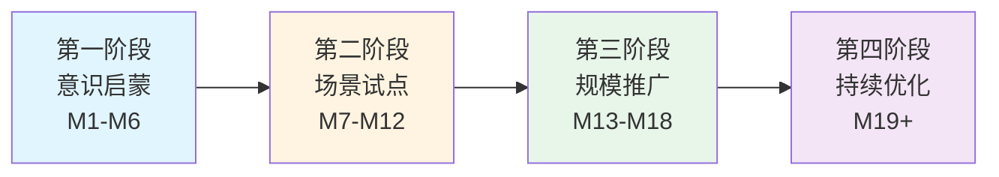

## 📋 方案概览

### 核心理念

**将 AI 从"尝鲜工具"升级为"全员数字员工"**，实现组织智能化跃迁。通过系统化的培训、激励和运营机制，让每位员工掌握 AI 技能，将个人效率提升转化为组织竞争力。

### 三大目标

::: info 规模化使用
**12个月 → 60% 日活率** | **18个月 → 80% 日活率**

平均每人每天使用 AI 工具 ≥3次，核心岗位100%覆盖
:::

::: info 生产力跃迁
**效率提升 27%** | **节省 11.4 小时/周**

内容创作速度提升3倍，错误率降低25%
:::

::: info 创新生态
**沉淀 100+ 案例** | **孵化 10+ 创新项目**

建立可复用的知识库，产生组织级创新成果
:::

### 实施路径

### 快速导航

  <h4>📖 战略规划</h4>
  
完整的18个月战略规划，包含背景分析、目标设定、实施路径、风险应对等

  <a href="/strategy/">查看详情 →</a>

  <h4>📊 运营方案</h4>
  
数据驱动的运营执行方案，包含采集体系、看板设计、激励机制、SOP流程

  <a href="/operation/">查看详情 →</a>

  <h4>💡 实施案例</h4>
  
国内外企业成功案例，包含微软、BCG、某互联网大厂等标杆实践

  <a href="/strategy/cases">查看案例 →</a>

  <h4>🛠️ 工具模板</h4>
  
周报月报模板、数据采集表、看板配置、SOP文档等开箱即用的工具

  <a href="/operation/templates">下载模板 →</a>

---

## 🎯 为什么现在？

2026年，AI应用已进入爆发期：

- 78%企业已部署AI工具，但仅35%员工接受过培训
- AI技能差距导致全球损失5.5万亿美元生产力
- 先行者正在建立不可逆的竞争优势

**现在行动，抢占未来3-5年的竞争制高点**

---

::: tip 💡 快速开始
建议先阅读[战略规划概览](/strategy/)了解全局，再深入[运营方案](/operation/)学习具体执行方法。
:::
