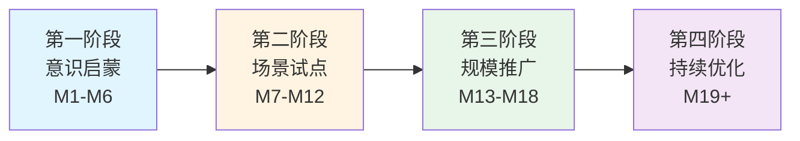

  

  

    <h2 style="font-size: 2.5rem; font-weight: 800; margin-bottom: 24px; color: white;">📊 核心数据指标</h2>
    
用数据说话，让成果可见

    

      

        
80%

        
18个月日活率目标

      

      

        
27%

        
生产力提升幅度

      

      

        
100+

        
创新案例沉淀

      

      

        
32.5x

        
投资回报率 ROI

      

    

  

## 📋 方案概览

### 🎯 核心理念

**将 AI 从"尝鲜工具"升级为"全员数字员工"**，实现组织智能化跃迁。通过系统化的培训、激励和运营机制，让每位员工掌握 AI 技能，将个人效率提升转化为组织竞争力。

  <h3 style="margin-top: 0; color: var(--vp-c-brand-1); display: flex; align-items: center; gap: 8px;">
    📈 规模化使用
  </h3>
  
12个月 → 60% 日活率 | 18个月 → 80% 日活率

  
平均每人每天使用 AI 工具 ≥3次，核心岗位100%覆盖

  <h3 style="margin-top: 0; color: var(--vp-c-brand-1); display: flex; align-items: center; gap: 8px;">
    🚀 生产力跃迁
  </h3>
  
效率提升 27% | 节省 11.4 小时/周

  
内容创作速度提升3倍，错误率降低25%

  <h3 style="margin-top: 0; color: var(--vp-c-brand-1); display: flex; align-items: center; gap: 8px;">
    💡 创新生态
  </h3>
  
沉淀 100+ 案例 | 孵化 10+ 创新项目

  
建立可复用的知识库，产生组织级创新成果

### 🛣️ 实施路径

### 🎯 四大阶段详解

  <h4 style="margin-top: 0; color: #6366f1;">阶段一：意识启蒙 (M1-M6)</h4>
  <ul style="margin: 0; padding-left: 20px;">
    <li>全员培训覆盖</li>
    <li>高管认知对齐</li>
    <li>文化氛围营造</li>
    <li>基础工具部署</li>
  </ul>

  <h4 style="margin-top: 0; color: #f59e0b;">阶段二：场景试点 (M7-M12)</h4>
  <ul style="margin: 0; padding-left: 20px;">
    <li>选定核心场景</li>
    <li>打造标杆案例</li>
    <li>验证价值模型</li>
    <li>优化激励机制</li>
  </ul>

  <h4 style="margin-top: 0; color: #10b981;">阶段三：规模推广 (M13-M18)</h4>
  <ul style="margin: 0; padding-left: 20px;">
    <li>全员强制推广</li>
    <li>数据监控体系</li>
    <li>案例快速复制</li>
    <li>持续培训迭代</li>
  </ul>

  <h4 style="margin-top: 0; color: #8b5cf6;">阶段四：持续优化 (M19+)</h4>
  <ul style="margin: 0; padding-left: 20px;">
    <li>智能化运营</li>
    <li>生态系统建设</li>
    <li>能力持续进化</li>
    <li>创新文化固化</li>
  </ul>

### 📚 快速导航

  <h4 style="margin-top: 0; display: flex; align-items: center; gap: 8px;">
    📖 战略规划
  </h4>
  
完整的18个月战略规划，包含背景分析、目标设定、实施路径、风险应对等

  <a href="/strategy/" style="display: inline-block; margin-top: 12px; padding: 8px 16px; background: var(--vp-c-brand-1); color: white; border-radius: 8px; text-decoration: none; font-weight: 600; transition: all 0.3s ease;">查看详情 →</a>

  <h4 style="margin-top: 0; display: flex; align-items: center; gap: 8px;">
    📊 运营方案
  </h4>
  
数据驱动的运营执行方案，包含采集体系、看板设计、激励机制、SOP流程

  <a href="/operation/" style="display: inline-block; margin-top: 12px; padding: 8px 16px; background: var(--vp-c-brand-1); color: white; border-radius: 8px; text-decoration: none; font-weight: 600; transition: all 0.3s ease;">查看详情 →</a>

  <h4 style="margin-top: 0; display: flex; align-items: center; gap: 8px;">
    💡 实施案例
  </h4>
  
国内外企业成功案例，包含微软、BCG、某互联网大厂等标杆实践

  <a href="/strategy/cases" style="display: inline-block; margin-top: 12px; padding: 8px 16px; background: var(--vp-c-brand-1); color: white; border-radius: 8px; text-decoration: none; font-weight: 600; transition: all 0.3s ease;">查看案例 →</a>

  <h4 style="margin-top: 0; display: flex; align-items: center; gap: 8px;">
    🛠️ 工具模板
  </h4>
  
周报月报模板、数据采集表、看板配置、SOP文档等开箱即用的工具

  <a href="/operation/templates" style="display: inline-block; margin-top: 12px; padding: 8px 16px; background: var(--vp-c-brand-1); color: white; border-radius: 8px; text-decoration: none; font-weight: 600; transition: all 0.3s ease;">下载模板 →</a>

---

  <h2 style="margin-top: 0; text-align: center; font-size: 2rem;">🎯 为什么现在？</h2>
  

    
2026年，AI应用已进入爆发期：

    <ul style="font-size: 1.05rem; line-height: 1.8; margin: 24px 0;">
      <li><strong>78%企业</strong>已部署AI工具，但仅<strong>35%员工</strong>接受过培训</li>
      <li>AI技能差距导致全球损失<strong>5.5万亿美元</strong>生产力</li>
      <li>先行者正在建立<strong>不可逆的竞争优势</strong></li>
    </ul>
    

      现在行动，抢占未来3-5年的竞争制高点
    

  

---

::: tip 💡 快速开始
建议先阅读[战略规划概览](/strategy/)了解全局，再深入[运营方案](/operation/)学习具体执行方法。
:::

  <h3 style="margin-top: 0; font-size: 1.8rem;">🚀 准备好开始了吗？</h3>
  
从战略规划到运营落地，我们为您准备了完整的实施指南

  

    <a href="/strategy/" style="display: inline-block; padding: 14px 32px; background: var(--vp-c-brand-1); color: white; border-radius: 12px; text-decoration: none; font-weight: 600; font-size: 1.05rem; transition: all 0.3s ease; box-shadow: 0 4px 12px rgba(99, 102, 241, 0.3);">开始探索战略规划</a>
    <a href="/operation/" style="display: inline-block; padding: 14px 32px; background: transparent; color: var(--vp-c-brand-1); border: 2px solid var(--vp-c-brand-1); border-radius: 12px; text-decoration: none; font-weight: 600; font-size: 1.05rem; transition: all 0.3s ease;">查看运营方案</a>
  

