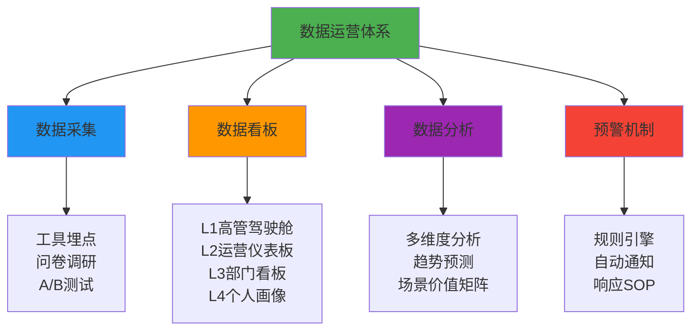
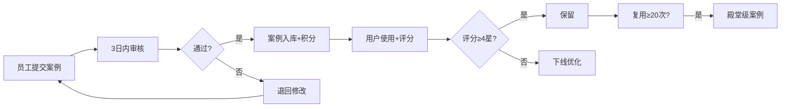

# 运营方案概览

> **基于战略文档**: 企业内部 2026 全员 AI 落地方案  
> **核心理念**: 数据驱动、实时可视、闭环运营

## 📊 执行方案概览

### 运营目标

- 通过数据驱动运营，支撑战略目标达成
- 18个月内实现80%日活率，100+案例沉淀
- 建立可视化、可预警、可迭代的运营体系

### 核心理念

::: info 三大核心原则
**数据先行** - 没有数据就没有管理

**实时可视** - 关键指标实时看板展示

**闭环运营** - 数据→洞察→行动→验证
:::

---

## 🎯 运营体系架构

---

## 📋 四级看板体系

### L1: 高管驾驶舱（战略级）

**展示内容**:
- 核心KPI：日活率、效率提升率、案例沉淀数
- 18个月目标达成进度
- 部门覆盖热力图
- 本周预警 & 亮点

**更新频率**: 每日早8点自动刷新  
**访问权限**: CEO、AI推进委员会成员

---

### L2: 运营仪表板（执行监控）

**展示内容**:
- 本周运营数据（日活率、案例提交、培训完成）
- 部门排行榜（按日活率）
- 案例贡献榜 & 热门案例Top 5
- 行动提示（需要跟进的事项）

**更新频率**: 每周一早8点  
**访问权限**: AI委员会、部门负责人、运营团队

---

### L3: 部门看板（对比PK）

**展示内容**:
- 部门对比表（日活率、案例贡献、综合评分）
- 月度流动红旗
- 进步最快部门

**更新频率**: 每周一  
**访问权限**: 全员可见（公开透明）

---

### L4: 个人画像（员工详情）

**展示内容**:
- 个人使用数据（活跃度、常用场景）
- 案例贡献 & 累计积分
- 学习轨迹 & 技能等级
- 成长建议

**更新频率**: 实时  
**访问权限**: 员工本人 + 直属主管

---

## 🎨 数据采集方案

### 核心数据指标

| 数据类别 | 关键指标 | 采集频率 | 数据来源 |
|---------|---------|----------|---------|
| **使用率数据** | 日活率、周活率、月活率 | 每日 | 工具后台 |
| **效率指标** | 时间节省、产出提升率 | 每月 | A/B测试 |
| **内容产出** | 案例提交数、复用次数 | 每周 | 案例库系统 |
| **用户反馈** | 满意度、NPS | 每季度 | 问卷系统 |

### 数据采集技术

- **工具埋点**: ChatGPT/Claude企业版后台 + 飞书多维表格API
- **A/B测试**: Excel人工记录 + Google Sheets协作
- **问卷调研**: 飞书表单 + 问卷星
- **案例库**: 飞书Wiki自动统计

---

## ⚠️ 预警机制

### 六大预警规则

| 预警类型 | 触发条件 | 预警级别 | 响应SOP |
|---------|---------|---------|---------|
| **日活率连续下降** | 连续2周下降≥5% | L2 | 72小时内部门访谈 |
| **日活率低于红线** | <30% 且连续2周无改善 | L3 | 7天内专项改进计划 |
| **满意度低于阈值** | 季度调研<3.5分 | L2 | 14天内焦点小组访谈 |
| **案例提交停滞** | 连续2周<目标值50% | L1 | 48小时内提醒+加码 |
| **培训完成率低** | <70% | L1 | 7天内二次催办 |
| **工具故障** | 不可用>30分钟 | L3 | 立即启动应急预案 |

### 自动化通知

- **L1级**: 邮件通知运营团队
- **L2级**: 飞书群@部门负责人
- **L3级**: 飞书群@AI委员会主席 + 短信

---

## 🎯 运营执行计划

### 第一个月行动清单（Week by Week）

#### Week 1: 基础设施搭建周

- ✅ 搭建飞书多维表格数据采集框架
- ✅ 配置工具后台埋点
- ✅ 创建案例库系统
- ✅ 设计数据看板原型
- ✅ 制定数据采集与隐私规范

#### Week 2: 数据看板上线周

- ✅ 完成四级看板搭建
- ✅ 编写看板使用手册
- ✅ 组织部门负责人培训会
- ✅ CEO试用并提意见

#### Week 3: 激励机制启动周

- ✅ 发布积分体系与奖励规则
- ✅ 上线积分兑换系统
- ✅ 创建"月度AI之星"评选流程
- ✅ 组织首次"案例秀"直播

#### Week 4: 预警机制调试周

- ✅ 开发预警规则引擎脚本
- ✅ 配置飞书群机器人Webhook
- ✅ 编写预警响应SOP手册
- ✅ 模拟预警测试

---

## 💰 激励机制设计

### 积分获取规则

| 行为类别 | 具体行为 | 积分 | 频次限制 |
|---------|---------|------|---------|
| **学习培训** | 完成L1基础培训 | +10 | 一次性 |
| | 完成L2进阶培训 | +30 | 一次性 |
| | 完成L3专家认证 | +100 | 一次性 |
| **案例贡献** | 提交标准案例（3星） | +20 | 无限制 |
| | 提交优秀案例（4星） | +50 | 无限制 |
| | 提交殿堂级案例（5星） | +100 | 无限制 |
| | 跨部门协作案例 | +100 | 无限制 |
| **案例复用** | 案例被他人使用1次 | +2 | 无限制 |
| **活跃使用** | 月度使用频次Top10% | +30 | 每月1次 |
| | 连续7天使用AI | +10 | 每7天1次 |
| **帮助他人** | 论坛回答问题（被采纳） | +5 | 无限制 |

### 积分兑换清单

| 积分 | 奖励 | 数量限制 |
|-----|------|---------|
| 50分 | 星巴克券（50元） | 不限 |
| 100分 | 京东卡（100元） | 不限 |
| 200分 | 带薪学习假（半天） | 每人每年4次 |
| 300分 | 外部培训课程（1000元） | 每人每年2次 |
| 500分 | AI创新项目启动基金（5000元） | 每人每年1次 |
| 1000分 | "年度AI达人"荣誉+奖金（5万元） | 每年1人 |

---

## 📚 案例沉淀流程

### 案例提交 → 审核 → 发布 → 维护

### 案例审核标准

| 维度 | 权重 | 评分标准 | 合格线 |
|------|------|---------|--------|
| **实用性** | 40% | 是否解决核心痛点 | ≥3分 |
| **可复用性** | 30% | 他人能否直接使用 | ≥3分 |
| **完整性** | 20% | 5个模块是否完整 | ≥3分 |
| **创新性** | 10% | 是否有独特巧思 | ≥2分 |

**总分≥15分 且 单项不低于合格线 → 通过**

---

## 🛠️ 运营工具清单

### 推荐工具组合（免费/低成本）

| 工具类别 | 推荐工具 | 用途 | 成本 |
|---------|---------|------|------|
| 数据采集 | 飞书多维表格 | 数据汇总 | 免费 |
| 看板搭建 | 飞书仪表盘 | L1/L2看板 | 免费 |
| | Excel + Power BI | L3看板 | 低（Office订阅） |
| 反馈收集 | 飞书表单 | 培训反馈 | 免费 |
| | 问卷星 | 季度深度调研 | 免费版 |
| 自动化 | Python脚本 | 预警引擎 | 免费 |
| | 飞书机器人 | 自动推送 | 免费 |
| 案例库 | 飞书Wiki | 案例展示 | 免费 |

**小型企业（<200人）**: 全部使用飞书多维表格（免费）  
**中型企业（200-1000人）**: 飞书 + Excel/Power BI  
**大型企业（>1000人）**: 飞书 + 自研系统

---

## 📅 日常运营 SOP

### 每日动作（8:00-9:00）

- ✅ 数据自动刷新
- ✅ 预警规则检查
- ✅ 查看运营仪表板
- ✅ 处理预警事项

### 每周动作（周一上午）

- ✅ 生成上周运营周报
- ✅ 周报推送全员+高管
- ✅ 更新部门排行榜
- ✅ 发布案例贡献榜
- ✅ 审核本周案例
- ✅ 组织"案例秀"直播

### 每月动作（每月第一周）

- ✅ 生成上月运营月报
- ✅ 月报汇报会（AI委员会）
- ✅ 发放月度积分奖励
- ✅ 评选"月度AI之星"
- ✅ 开展月度快速调研

---

## 📊 详细内容导航

  <h3>📊 数据运营体系</h3>
  
数据采集方案、四级看板设计、多维度分析框架、预警机制详解

  <a href="/operation/data-system">查看详情 →</a>

  <h3>🚀 运营执行计划</h3>
  
第一个月行动清单、日常运营SOP、用户激励方案、案例沉淀流程

  <a href="/operation/execution">查看详情 →</a>

  <h3>🛠️ 运营工具清单</h3>
  
数据采集工具、看板搭建工具、反馈收集工具、自动化工具推荐

  <a href="/operation/tools">查看详情 →</a>

  <h3>📋 模板和范例</h3>
  
周报月报模板、数据采集表、看板配置、预警通知模板等

  <a href="/operation/templates">下载模板 →</a>

---

## 💡 核心亮点

::: tip 🌟 三大运营创新

**1. 四级看板体系**
- 从CEO到员工，每个层级都有专属看板
- 数据实时可视，决策有据可依
- 全员透明，激发竞争活力

**2. 自动化预警机制**
- 6大预警规则，7×24小时监控
- 分级响应，问题不过夜
- 预警→访谈→改进→验证闭环

**3. 游戏化激励体系**
- 积分、勋章、排行榜，激发参与
- 物质+精神+发展三重激励
- 71%积分兑换率，流动性健康
:::

---

## 📈 运营效果预期

基于标杆企业经验：

- **第1个月**: 数据体系搭建完成，基线数据采集
- **第3个月**: 日活率突破30%，首批20个案例沉淀
- **第6个月**: 日活率突破50%，运营进入良性循环
- **第12个月**: 日活率达到60%，案例库突破60个
- **第18个月**: 日活率达到80%，案例库突破100个

---

::: info 💬 需要支持？
运营方案提供完整的工具、模板、SOP，开箱即用。如需定制化支持，请联系运营团队。
:::
