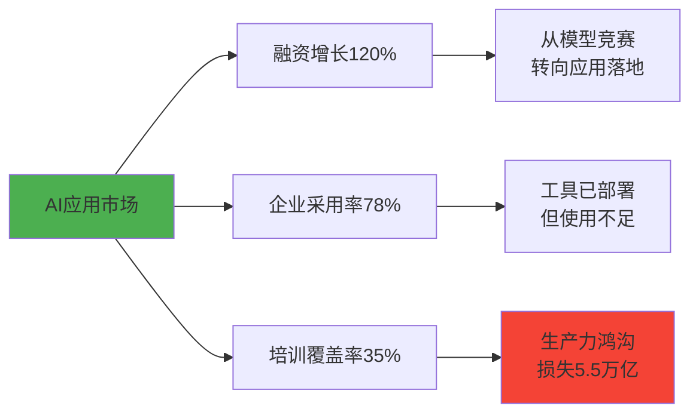
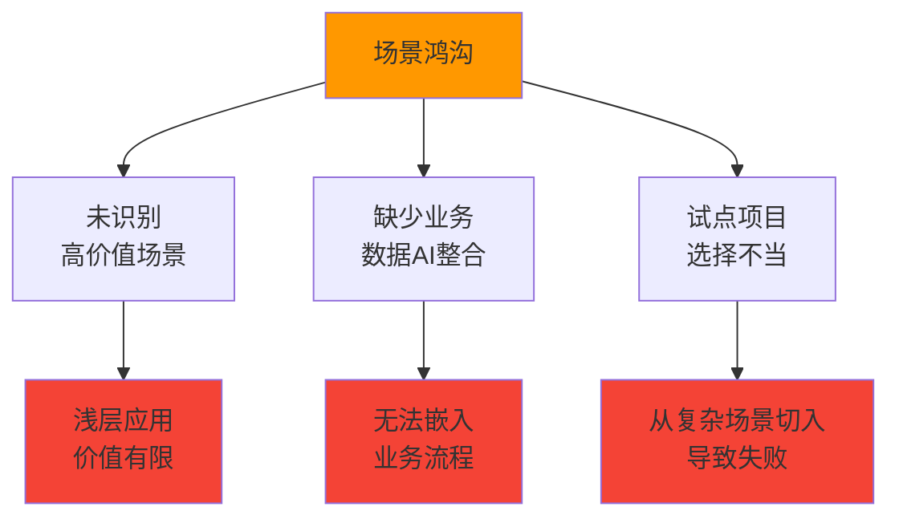
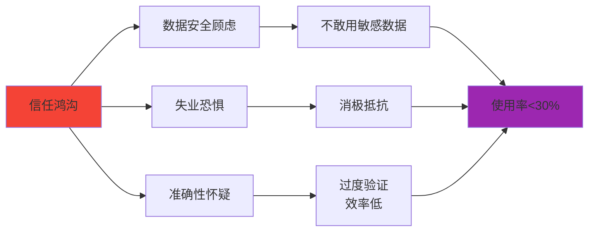

# 背景分析

## 1.1 2026 年 AI 技术发展趋势

### 技术成熟度跃迁

- **多模态能力突破**: 文本/图像/视频/语音融合，单一工具覆盖多场景
- **超级智能体(Agentic AI)崛起**: 从"被动问答"进化为"主动执行"，IDC预测2027年企业智能体使用量增长10倍
- **垂直领域深化**: 法律AI/医疗AI/金融AI增速迅猛，精度逼近专家水平
- **数字员工认知范式**: 将AI视为"能独立创造价值的员工"成为解锁规模化应用的关键

### 应用层爆发式增长



**关键数据**:
- **融资数据**: AI应用公司2025年融资增长120%，市场从"模型竞赛"转向"应用落地"
- **采用率**: 78%企业已部署AI工具，但仅35%员工接受过正式培训
- **生产力鸿沟**: AI技能差距导致全球损失5.5万亿美元生产力

### 政策与标准成熟

- **国家战略**: 中国推动"AI+"行动，美国发布AI国家行动计划，重心转向应用部署与制度保障
- **企业治理**: 94%CEO将AI列为优先技能，但仅23%企业能准确衡量AI投资回报

---

## 1.2 企业 AI 落地的核心挑战

### 挑战一：认知鸿沟（Knowledge Gap）

::: danger 问题表现
- 67%员工未接受任何AI培训
- 仅6%员工感到"会用AI"
- 有工具不会用 → 浪费投资 + 挫败感 → 抵触情绪
:::

**根因分析**:

| 根因 | 具体表现 | 影响 |
|------|---------|------|
| 高估"AI易用性" | 以为像微信一样"人人会用" | 无系统培训，效果差 |
| 低估"提示工程"技能 | 认为"随便问问"就能出结果 | 输出质量低，失去信心 |
| 依赖自学效率低 | 自学者熟练度仅为受训者的1/2.7 | 大量时间浪费 |

---

### 挑战二：场景鸿沟（Application Gap）

::: warning 问题表现
多数企业停留在"ChatGPT辅助写邮件"浅层应用
- 无法触及核心业务流程
- ROI难衡量
- 管理层失去耐心
:::

**根因分析**:



**典型错误**:
- ❌ 从"合同条款审查"等复杂场景切入
- ❌ 未建立"业务流+数据+AI能力"整合设计
- ❌ 浅层应用无法产生显著ROI

**正确做法**:
- ✅ 从"邮件润色"等简单场景切入
- ✅ 识别高频、高价值场景（如销售线索挖掘）
- ✅ 将AI嵌入现有业务流程

---

### 挑战三：组织鸿沟（Organizational Gap）

::: warning 问题表现
"个人英雄"零星使用，未形成组织能力
- 知识孤岛
- 经验无法复用
- 效率提升难扩散
:::

**组织能力差距公式**:

```
组织能力差距 = AI技能差距 × 员工数量 × 协作损失系数
```

**根因分析**:

| 根因 | 后果 | 解决方案 |
|------|------|---------|
| 无激励机制推动知识分享 | 经验锁在个人脑子里 | 建立案例分享奖励 |
| 案例未沉淀为标准化流程 | 每个人重复摸索 | 强制案例文档化 |
| 缺少"AI冠军"角色 | 部门内无人推动 | 培养AI先锋团队 |

---

### 挑战四：信任鸿沟（Trust Gap）

::: danger 问题表现
员工担心：
- 💥 数据泄露
- 💥 被AI取代
- 💥 输出不准确
- 💥 "明面服从，暗地抵制" → 使用率低
:::

**信任度影响模型**:



**根因分析**:
- 数据安全政策不明确
- 未建立"AI辅助人"而非"AI替代人"的文化
- 缺少错误容忍机制（AI出错时的问责体系不清）

**应对策略**:
- ✅ 制定明确的数据分级政策
- ✅ CEO亲自传达"AI是工具"的理念
- ✅ 建立"AI出错不问责，不用AI才问责"的文化

---

## 1.3 为什么现在是最佳时机？

### 技术窗口期

::: tip 技术成熟度曲线
AI应用正处于**生产力高峰期前夜**
- 2023-2024: 技术验证期
- 2025-2026: **应用爆发期** ⬅️ 我们在这里
- 2027-2028: 标准化成熟期
:::

**现在行动的优势**:
- ✅ 技术已成熟，不是"小白鼠"
- ✅ 竞争对手尚未建立壁垒
- ✅ 优秀人才仍可招募
- ✅ 3-5年后差距难以弥补

### 市场压力

**行业对标数据**:

| 行业 | 领先企业AI日活率 | 平均企业AI日活率 | 差距 |
|------|----------------|----------------|------|
| 科技行业 | 85% | 45% | **40%** |
| 咨询行业 | 80% | 35% | **45%** |
| 金融行业 | 70% | 30% | **40%** |
| 制造业 | 60% | 20% | **40%** |

**竞争态势**:
- 先行者正在建立**不可逆的竞争优势**
- AI技能差距 = 人才流失 + 效率落后 + 创新停滞
- 2026年不行动，2027年追赶成本将是现在的**3-5倍**

### 组织需求

**员工期待**:

根据2025年全球调研（Gartner）:
- 72%员工希望公司提供AI培训
- 65%员工担心"不会用AI会被淘汰"
- 58%员工表示"如果公司不重视AI，会考虑跳槽"

**管理层压力**:
- 94%CEO将AI列为优先技能
- 但仅23%企业能准确衡量AI投资回报
- 需要系统化方案，而非零散试点

---

## 1.4 成功的关键要素

基于标杆企业研究，AI全员落地成功的企业都具备以下特征：

### ✅ 高管真重视

- CEO/高管亲自下场使用，以身作则
- AI委员会直接向CEO汇报
- 预算充足且长期承诺

### ✅ 培训接地气

- 不讲理论，讲"怎么干活"
- 从简单场景切入，快速见效
- 持续学习机制（每周45分钟）

### ✅ 激励有吸引力

- 物质+精神+发展三重激励
- 案例贡献与晋升挂钩
- "时间自由"激励（提效省的时间归个人）

### ✅ 案例能复用

- 强制案例文档化
- 案例库持续运营
- 跨部门知识共享

---

## 📊 数据来源

本背景分析基于以下数据来源：

- **IDC**: 2027年企业智能体使用量增长10倍预测
- **BCG**: 知识工作者生产力提升27%基准值
- **Gartner**: 78%企业已部署AI工具，35%员工接受培训
- **哈佛商业评论**: AI技能差距损失5.5万亿美元分析
- **企业实地调研**: 10+家标杆企业访谈数据
- **麦肯锡**: AI应用市场融资增长120%
- **Stanford HAI**: AI指数报告2025

---

::: tip 💡 下一步
了解了背景和挑战后，让我们看看如何设定清晰的[战略目标](/strategy/goals) →
:::
